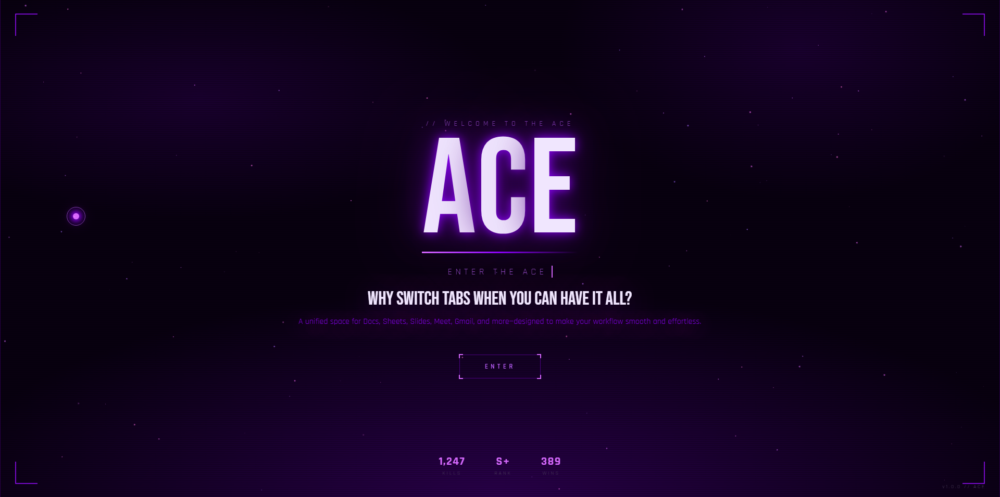
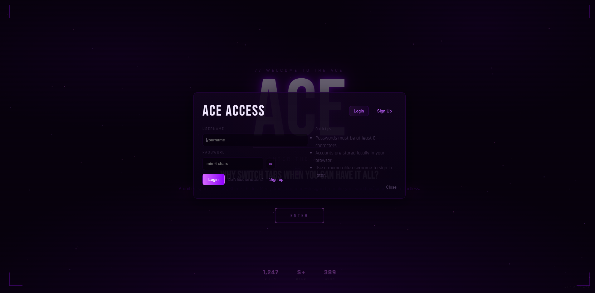
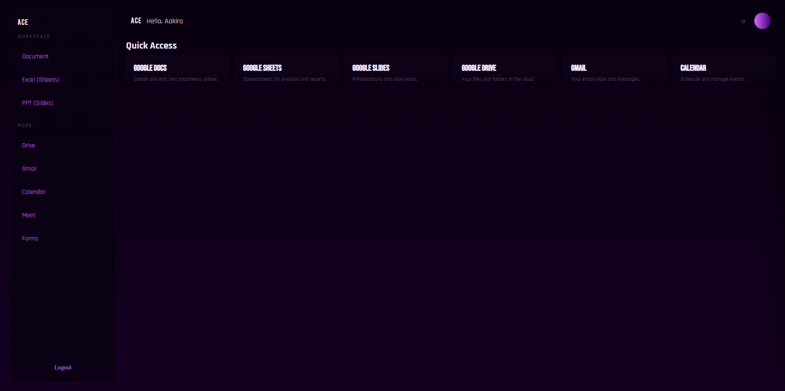

# 🚀 ACE – Your All-in-One Google Workspace Hub

> Why switch tabs when you can have it all?

ACE is a sleek, modern web app that brings all essential Google tools into one unified dashboard—designed for speed, simplicity, and productivity.

---

## ✨ Features

- 📄 **Google Docs** – Create and edit documents instantly  
- 📊 **Google Sheets** – Manage data and analytics  
- 📽️ **Google Slides** – Build presentations effortlessly  
- 📁 **Google Drive** – Access your cloud files  
- 📧 **Gmail** – Stay connected with your inbox  
- 📅 **Calendar** – Organize your schedule  
- 🎥 **Google Meet** – Join meetings quickly  
- 📝 **Google Forms** – Create surveys and forms  

---

## 🎯 Key Highlights

- ⚡ **One Dashboard Access** – No more tab switching  
- 🎨 **Modern UI/UX** – Clean neon aesthetic with smooth experience  
- 🔐 **Simple Authentication** – Login & Signup system (local storage-based)  
- 📱 **Responsive Design** – Works across devices  
- 🚀 **Fast & Lightweight** – Built for efficiency  

---

## 🖥️ Screenshots

### Dashboard


### Login System


### Homescreen


---

## 🛠️ Tech Stack

- **Frontend:** HTML, CSS, JavaScript  
- **Design:** Minimal + Neon UI  
- **Storage:** Local Storage (for authentication)  

---

## ⚙️ How to Run Locally

```bash
# Clone the repository
git clone https://github.com/Aakira14/ace.git

# Open folder
cd ace

# Run the project
Just open index.html in your browser
